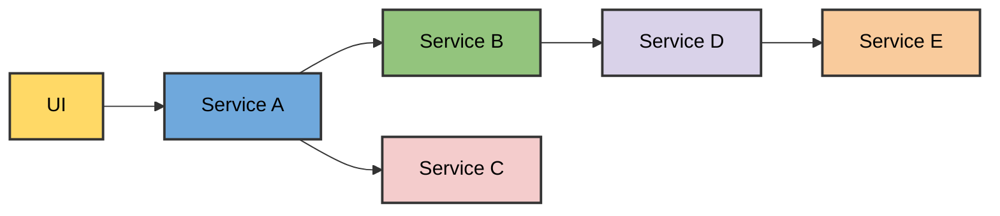

## The problem

At PreviousJob our engineers could take days to test changes because it was impractical to run some services locally. Reasons included complex interdependencies, chonky GPU requirements, and Windows services on Apple silicon.

I was working on the devex team at the time and this sounded like an interesting problem.

We were practicing trunk-based continuous development with feature flags but that _really_ slowed down the process. A production deployment to test a change because it's too difficult to test locally?

And a difficult dev cycle results in more bugs, more incidents.

For the UI it’s an easy solve because the UI initiates requests - downstream services don’t connect back to it, so you can have as many UIs as you want.

But say you have this:



And you want to re-route requests for **service D**. How do you do that? We considered:

1.  Spin up a copy of the dev environment with a different version of **service D**.

2.  Figure how to apply dynamic routing. Keep the shared dev env, but somehow use a substitute for **service D** in some situations.

Option 1 is expensive and results in a proliferation of environments that are awkward to manage.

Option 2 is more complex, unknowable at the start, but felt right for the long term. The difficulty stemmed from not having a complete understanding of our service-to-service comms.

## Constraints

We had a small devex team that could work on this. Other teams had their own roadmaps, so orchestrating changes to each service would have been slow. We knew that per-service changes wasn't the right direction.

Given this problem was hurting us right now, what could we do?

## Our infrastructure

We were using ECS, not Kubernetes. No service mesh. Maybe there's pre-existing solutions that you can slot into Kubernetes, but definitely not with our architecture.

We didn’t have a shared service library, so an application level change would need to be made to _all_ applications.

Luckily the bulk of service-to-service comms were HTTP, and these all went through a load balancer. Sure we had some SNS, SQS, Temporal, but starting with HTTP covered 99% of the problems.

## Dynamic routing

We added a dynamic router service in front of our load balancer. Settled on [Caddy](https://caddyserver.com/) after a couple of iterations so we could focus on the business logic rather than the transport. Caddy was impressive. Nicely architected and straightforward to extend.

Next problem: route persistence. You can send a custom header to the first service, saying you want to make a substitution for **service D**. But how does each service pass that routing info down the chain? Remember that we didn’t want to update all of our services to enable this.

Oh wait. Passing metadata between services is what distributed tracing does. Tracing SDKs intercept incoming and outgoing requests to maintain a constant context for all requests in a chain. We’d been on a big push for tracing the previous year so got context propagation for free!

For extra data such as routing you can use the [baggage header](https://opentelemetry.io/docs/concepts/signals/baggage/). We investigated that however not all of our services supported it. For our tracing push we’d generally implemented _just enough_ support but _not_ the baggage header - not consistently.

Ah well. We can still read a routing header on the first request, associate it with the trace ID in Redis, and read it out again on subsequent requests in the chain which will share the trace ID.

## Route configuration

So we can re-route based on a header and pass that along to all downstream services.

Next up - injecting that header into the first request.

For API clients such as [Bruno](https://www.usebruno.com/) it’s simple enough.

For the browser I built a Chrome extension that provided a UI. My first Chrome extension! I paid 5$ for a developer account and shortly after had a private extension available to the company. I’d imagine Chrome's review process is slower for public extensions but for private it really didn’t take long at all. We’d anticipated a delay so initially advised testers to clone a repo and [load the unpacked extension](https://developer.chrome.com/docs/extensions/get-started/tutorial/hello-world#load-unpacked), but now I wouldn’t bother. Just get it listed in the store.

## Peering laptop services into the cloud

We were retiring our VPN solution but didn’t have a clear replacement yet.

[ngrok](https://ngrok.com/) was the quick win. We abstracted it to guard against enshittification but it performed well. I think there’s a service limit, we used a local HTTP router service to sidestep this.

Some other talented folk had already created a devex CLI that bootstrapped and ran services, so getting that to run this local infrastructure was straightforward.

The local infra handled the HTTP routing from ngrok and periodically sent service config to the dynamic router with a short-lived TTL.

## Service onboarding

I mentioned we didn’t want to change all the services. That’s still true, the only services that needed to change are those that want to opt-in to service substitution. Other services in the chain can keep running as-is.

Registering a local service for peering required an addition to the service's `docker-compose.yaml`:

```yaml
warp-pipe:
  image: xyz.com/warp-pipe
  environment:
    CONFIG: |
      serviceName: my-service
      endpoints:
      - name: api
        type: http
        port: 8080
```

## Results

The first demo had good feedback and general excitement. It felt like we were on the right path. For rollout we went service-by-service, starting with some of the tightly-coupled services and moving to the monolith. We didn’t want to onboard everything at once and chose to solve the common problems before opening it up to the wider engineering team.

Metrics showed that engineers kept using it regularly - it wasn’t just an initial curiosity. The merge/deploy/test loops effectively disappeared for a good number of uses.

I no longer work at the company so haven’t seen how it’s evolved, but am told it’s still in use. I'm proud of that.

## Takeaways

Getting engineers to change their workflow is a problem in itself. I put as much thought into the developer experience as I did the system design.

The most useful things I built reused what was already there - the load balancer and the trace propagation.

Making local services peer with shared cloud envs means that mistakes are no longer local. Someone could accidentally trigger a migration on a shared environment, drop a table, etc. Think about checking your DB permissions, sorting out backups, all the good stuff you might not have bothered with on dev.

## Prior art

- [Monzo: Redefining our microservice development process](https://monzo.com/blog/2022/06/24/redefining-our-microservice-development-process)
- [Sailpoint: how we are solving one of the most common problems in microservices development](https://medium.com/sailpointengineering/beacon-mode-how-we-are-solving-one-of-the-most-common-problems-in-microservices-development-b98cb532772a)
